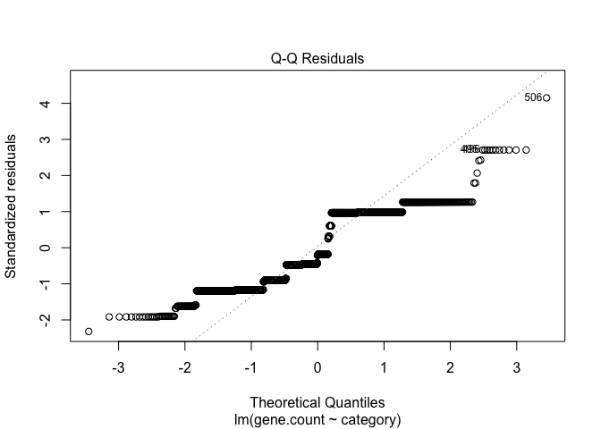

# Why parameteric ANOVA isn’t a good idea for this data set
Drew Steen

# Introduction

The purpose of this analysis is to assess whether parametric ANOVA is an
appropriate way to test differences among gene abundance for the orz-zor
and tisB-istR toxin-antitoxin systems, as a function of region and
pathotype.

# zor-orz

``` r
library(tidyverse)
library(MASS)
library(furrr)
library(tictoc)
library(rlang) # this is maybe needed by calculate_mean_diff
plan(multisession)
#source("R/helper_funs.R")
helper_funs <- paste0("R/", dir("R"))
purrr::walk(helper_funs, source)

theme_set(theme_classic()) 
```

``` r
# Read in raw zor-orz data
region_zor <- readxl::read_xlsx("data/FINAL data for Steen.xlsx", 
                            sheet = "zor-orz gene number",
                            range = "A11:G18") %>%
  rename(gene.count = Continent) %>%
  pivot_longer(-1, names_to = "category", values_to = "count") %>%
  group_by(category) %>%
  mutate(freq = count / sum(count, na.rm = TRUE))
  
path_zor <- readxl::read_xlsx("data/FINAL data for Steen.xlsx", 
                            sheet = "zor-orz gene number",
                            range = "A1:E8") %>%
  rename(gene.count = Pathotype) %>%
  pivot_longer(-1, names_to = "category", values_to = "count") %>%
  group_by(category) %>%
  mutate(freq = count / sum(count, na.rm = TRUE))

# recreate raw data based on frequencies of gene abundance
raw_region_zor <- recreate_raw(region_zor) %>%
  arrange(category) # this appears to have worked
raw_path_zor <- recreate_raw(path_zor)

# Make some boxplots
p_region <- raw_data_boxplot(raw_region_zor)
p_path <- raw_data_boxplot(raw_path_zor)

# Make up plots for later display
p_reg_line <- raw_line_plot(raw_region_zor)
p_path_line <- raw_line_plot(raw_path_zor)
p_reg_bar <- raw_bar_plot(raw_region_zor)
p_path_bar <- raw_bar_plot(raw_path_zor)
```

I’m not really sure what the best way to display these is, so I’m giving
three options:


These data sets have some subtle differences in distributions among
pathotypes/regions, which are easiest to see in the middle row of
colored line plots. Is a linear model (ANOVA) good for these data?
Specifically: ANOVA is fairly robust to unbalanced designs and to
heteroskedasticity, but not to hetereoskedastic data in an unbalanced
design. So let’s check the heteroskedasticity.

### Linear model for regions

``` r
region_model <- lm(gene.count ~ category, data=raw_region_zor)
saveRDS(region_model, "data/region_model.rds") # save for other workbooks
summary(aov(region_model))
```

                  Df Sum Sq Mean Sq F value   Pr(>F)    
    category       5     90  17.983   9.335 8.61e-09 ***
    Residuals   1780   3429   1.926                     
    ---
    Signif. codes:  0 '***' 0.001 '**' 0.01 '*' 0.05 '.' 0.1 ' ' 1

This model finds significant differences among regions. But before we
take this too seriously, let’s check whether the residuals are normally
distributed. A good way to do that is via a QQ plot. The

``` r
plot(region_model, which=2) 
```



I’d say we these residuals are sufficiently non-normally distributed
that a linear model is not a good choice for the regional data.


### Linear model for pathotypes

``` r
path_model <- lm(gene.count ~ category, data=raw_path_zor)
saveRDS(path_model, "data/path_model.rds") # save for main workbook
summary(aov(path_model))
```

                 Df Sum Sq Mean Sq F value Pr(>F)    
    category      3  201.9   67.30   46.03 <2e-16 ***
    Residuals   601  878.6    1.46                   
    ---
    Signif. codes:  0 '***' 0.001 '**' 0.01 '*' 0.05 '.' 0.1 ' ' 1

Again, significant differences among pathotypes.

``` r
plot(path_model, which=2)
```


Same situation here. The QQ-plot is sufficiently
not-like-a-straight-line that I don’t really want to interpret the p
values that come from it.

## Poisson distribution?

I propose that we can think of gene distribution as a poisson process,
where different values of $\lambda$ indicate different probabilities of
the gene being “handed out”. If this is the case, we can assess whether
there are difference in lambda among regions or pathotypes - but first
we need to assess whether the data are, in fact, poisson-distributed.
We’ll simply load the data, fit it to a poisson distribution, and see
whether the fit looks good. I think in this case a qualitative
assessment is at least as good as some kind fo statistical test of
goodness-of-fit.

``` r
d <- rbind(region_zor %>% mutate(type="region"),
           path_zor %>% mutate(type="path")) %>%
  mutate(category=factor(category, levels = c("Africa","Asia", "Europe", "North America", "Oceania", "South America", "pa", "healthy", "intestinal disease", "urinary disease"), ordere=TRUE))

ggplot(d, aes(x=gene.count, y=count)) + 
  geom_point() + 
  facet_wrap(~category, scale="free_y")
```


These data do not look poisson-distributed. I’m pretty sure that part of
the issue is there is correlation between the two genes in terms of
whether they are likely to appear in the genome - that is, if one of the
genes is present, the other is likely to be as well. Note there are
almost never exactly 3 genes present. So, I don’t really want to model
this with Poisson distributions.

# tisB - istR analysis

We want to do the same analysis for the tisB-istR gene pair.

First load the data.

``` r
# Read in raw tisB-istR data
tisB_region <- readxl::read_xlsx("data/FINAL data for Steen.xlsx", 
                            sheet = "tisB-istR gene number",
                            range = "A11:G13") %>%
  rename(gene.count = Continent) %>%
  pivot_longer(-1, names_to = "category", values_to = "count") %>%
  group_by(category) %>%
  mutate(freq = count / sum(count, na.rm = TRUE))

tisB_path <- readxl::read_xlsx("data/FINAL data for Steen.xlsx", 
                            sheet = "tisB-istR gene number",
                            range = "A1:E3") %>%
  rename(gene.count = Pathotype) %>%
  pivot_longer(-1, names_to = "category", values_to = "count") %>%
  group_by(category) %>%
  mutate(freq = count / sum(count, na.rm = TRUE))

raw_region_tisB <- recreate_raw(tisB_region) %>%
  arrange(category) # this appears to have worked
raw_path_tisB <- recreate_raw(tisB_path) %>%
  arrange(category)
```

### Linear models

``` r
tisB_region_model <- lm(gene.count ~ category, data=raw_region_tisB)
summary(aov(tisB_region_model))
```

                  Df Sum Sq Mean Sq F value   Pr(>F)    
    category       5   15.4  3.0890   6.237 9.63e-06 ***
    Residuals   1780  881.6  0.4953                     
    ---
    Signif. codes:  0 '***' 0.001 '**' 0.01 '*' 0.05 '.' 0.1 ' ' 1

``` r
plot(tisB_region_model, which=2)
```


Wow, that’s the worst one yet.

``` r
tisB_path_model <- lm(gene.count ~ category, data=raw_path_tisB)
summary(aov(tisB_path_model))
```

                 Df Sum Sq Mean Sq F value Pr(>F)    
    category      3  84.68  28.225   65.96 <2e-16 ***
    Residuals   601 257.18   0.428                   
    ---
    Signif. codes:  0 '***' 0.001 '**' 0.01 '*' 0.05 '.' 0.1 ' ' 1

``` r
plot(tisB_path_model, which=2)
```


Clearly, ANOVA is not the right choice for these data. We’ll try a Monte
Carlo approach.
